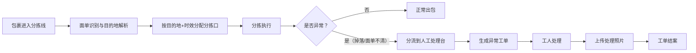
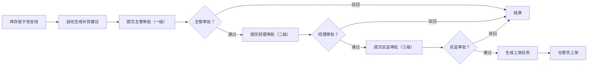
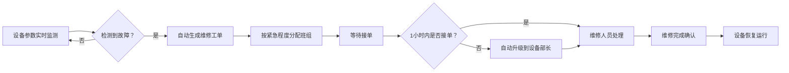

## 1. 产品概述

大型电商智能仓储与分拣调度管理平台，实现从订单接入、智能拣货路线规划、自动化分拣、库存管理、设备监控到员工绩效的全链路数字化管理。解决传统仓储作业效率低、错发漏发、库存混乱、设备故障响应慢等问题，目标用户为电商仓储运营团队，覆盖分拣员、组长、经理、总监四级角色。

产品目标：将仓储分拣效率提升40%以上，订单准确率达99.9%，设备故障率降低50%，员工绩效透明化。

## 2. 核心功能

### 2.1 用户角色

| 角色 | 注册方式 | 核心权限 |
|------|----------|----------|
| 分拣员 | 管理员创建 | 查看个人任务、扫码上岗/领取任务、处理异常、查看个人绩效 |
| 组长 | 管理员创建 | 管理本区域任务、查看区域绩效、审批补货申请（一级）、分配本区域员工 |
| 经理 | 管理员创建 | 全仓库数据查看、审批补货申请（二级）、排班管理、查看所有工单 |
| 总部/总监 | 管理员创建 | 全局管理、审批补货申请（三级）、多仓库数据汇总、月度报告导出、权限管理 |

### 2.2 功能模块

1. **首页数据大屏**：分拣效率走势图、设备完好率、订单及时率、今日订单量、实时数据刷新、区域筛选
2. **订单管理中心**：订单列表、波次合并、智能拣货路线规划、任务推送、扫码领取
3. **智能分拣中心**：分拣口自动分配、异常分流、人工处理台、异常工单、照片确认
4. **库存管理中心**：库存监控、安全线预警、补货建议、多级审批、上架任务
5. **设备监控中心**：设备实时参数、故障告警、维修工单、紧急程度分级、升级机制
6. **员工管理中心**：扫码上岗、智能排班、效率统计、绩效排名、动态展示
7. **报告分析中心**：运营数据多维筛选、月度分析报告、一键导出
8. **系统权限中心**：四级权限控制、角色管理、数据权限隔离

### 2.3 页面详情

| 页面名称 | 模块名称 | 功能描述 |
|----------|----------|----------|
| 登录页 | 登录模块 | 账号密码登录、角色自动识别、记住登录状态 |
| 首页大屏 | 数据概览 | 分拣效率走势图（折线图）、设备完好率（仪表盘）、订单及时率（环形图）、今日订单量（数字卡片）、实时刷新动画、区域筛选下拉框 |
| 订单管理 | 订单列表 | 订单状态筛选、按地址/仓库区域查询、订单详情查看、批量波次合并按钮 |
| 订单管理 | 波次管理 | 波次列表、波次状态跟踪、拣货路线可视化、任务分配记录 |
| 订单管理 | 任务终端 | 员工个人任务列表、扫码领取、任务状态更新、异常上报入口 |
| 智能分拣 | 分拣监控 | 分拣线实时状态、各分拣口吞吐量、包裹追踪、异常告警提示 |
| 智能分拣 | 异常处理 | 异常工单列表、人工处理台、照片上传、处理确认 |
| 库存管理 | 库存监控 | 库存SKU列表、安全线预警标记、库存位置查询、ABC分类展示 |
| 库存管理 | 补货审批 | 补货申请单、多级审批流程（主管→经理→总监）、审批意见、审批历史 |
| 库存管理 | 上架任务 | 上架任务列表、库位分配、扫码上架确认 |
| 设备监控 | 设备总览 | 设备列表（传送带/分拣机/扫码枪）、运行参数实时展示、健康状态标识 |
| 设备监控 | 维修工单 | 故障工单、紧急程度分级（紧急/一般/低）、班组分配、超时自动升级 |
| 员工管理 | 出勤管理 | 扫码上岗/离岗、出勤记录、工时统计 |
| 员工管理 | 智能排班 | 基于订单量预测的排班建议、排班表、调班申请 |
| 员工管理 | 绩效考核 | 个人效率统计（拣货量/分拣量/准确率）、绩效排名榜、绩效趋势图 |
| 报告分析 | 运营报告 | 多维度筛选（仓库区域/日期/指标）、数据可视化图表、月度报告一键导出（Excel/PDF） |
| 系统设置 | 权限管理 | 角色管理、用户管理、数据权限配置 |

## 3. 核心流程

### 3.1 订单拣货流程
订单进入系统后，系统根据收货地址和库存位置自动规划最优拣货路线，将同一区域订单合并成波次批量拣货，减少走动距离。任务生成后推送到员工终端，员工扫码领取任务完成拣货。

### 3.2 智能分拣与异常处理流程
包裹进入分拣线后，系统根据目的地和时效自动分配分拣口。当检测到货品掉落异常或面单不清时，自动分流到人工处理台并生成异常工单，工人处理完需上传照片确认。

### 3.3 库存补货多级审批流程
库存低于安全线时系统自动生成补货建议，触发主管→经理→总监三级审批，全部审批完成后生成上架任务。

### 3.4 设备故障维修流程
传送带、分拣机等设备实时监测运行参数，故障自动生成维修工单并按紧急程度分配班组，超1小时未接单升级到设备部长。

## 4. 用户界面设计

### 4.1 设计风格
- **主色调**：科技蓝 (#1E40AF) 搭配工业橙 (#F97316)，体现智能制造与高效运营
- **辅助色**：深灰 (#1F2937) 作为背景，成功绿 (#10B981)、警告黄 (#F59E0B)、危险红 (#EF4444) 作为状态标识
- **按钮风格**：圆角6px，主按钮采用渐变蓝，悬停有微浮动效果
- **字体**：数字展示使用"JetBrains Mono"等宽字体，正文使用"Noto Sans SC"
- **布局风格**：深色工业风仪表盘布局，左侧导航栏 + 顶部状态栏 + 主内容区域，大量使用卡片式组件
- **图标风格**：线性图标（Lucide/Remix风格），统一2px线条，颜色与文字一致

### 4.2 页面设计概览

| 页面名称 | 模块名称 | UI元素 |
|----------|----------|--------|
| 首页大屏 | 数据概览 | 深色背景、发光数字卡片、实时折线图（带动画）、仪表盘、环形进度图、数据脉冲刷新动画、顶部状态栏显示仓库区域选择器 |
| 订单管理 | 订单/波次列表 | 数据表格、状态标签、筛选栏、批量操作按钮、路线可视化地图、进度条 |
| 智能分拣 | 分拣监控 | 分拣线拓扑图、实时数据流动画、异常红点告警、人工处理台卡片式工单 |
| 库存管理 | 库存监控 | SKU卡片网格、安全线红色预警、ABC分类色块、审批流程时间轴 |
| 设备监控 | 设备总览 | 设备卡片（运行状态灯效）、参数仪表盘、故障工单紧急程度颜色区分 |
| 员工管理 | 绩效排名 | 排行榜样式、头像、奖牌图标、效率对比柱状图、实时排名变化动画 |
| 报告分析 | 运营报告 | 多标签页图表、筛选表单、导出按钮（带加载动画） |

### 4.3 响应式
- 采用桌面优先设计（1920×1080基准），适配1366px及以上分辨率
- 侧边栏可折叠，适配小屏幕
- 员工终端页面单独优化，适配平板/手机端扫码操作
- 表格支持横向滚动，数据卡片自适应换行

### 4.4 动效设计
- 数据每5秒刷新时，数字有滚动递增动画
- 页面加载有骨架屏效果
- 异常告警有脉冲闪烁动画
- 状态切换有平滑过渡
- 绩效排名变化有上下浮动动画
- 设备状态灯有呼吸效果
