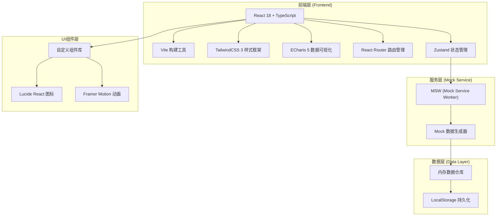
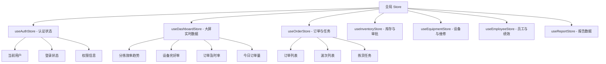

## 1. 架构设计



## 2. 技术描述

- **前端框架**：React 18 + TypeScript 5，采用函数组件和Hooks开发
- **初始化工具**：Vite 5，提供快速冷启动和热更新
- **样式方案**：TailwindCSS 3.4 + CSS Variables，支持深色主题
- **图表可视化**：ECharts 5.5，用于折线图、仪表盘、环形图、柱状图、热力图等
- **路由管理**：React Router DOM 6，支持嵌套路由和路由守卫
- **状态管理**：Zustand 4，轻量级状态管理，分模块存储
- **图标库**：Lucide React，线性风格图标
- **动画库**：Framer Motion 11，用于交互动画和过渡效果
- **Mock方案**：Mock Service Worker (MSW) 2，模拟REST API
- **数据导出**：xlsx库用于Excel导出，jspdf用于PDF导出
- **工具库**：dayjs日期处理、lodash工具函数

## 3. 路由定义

| 路由 | 页面名称 | 权限要求 | 说明 |
|------|----------|----------|------|
| /login | 登录页 | 公开 | 账号密码登录 |
| /dashboard | 首页大屏 | 全部角色 | 实时数据展示、分拣效率/设备/订单概览 |
| /orders | 订单管理 | 组长/经理/总监 | 订单列表、波次管理 |
| /orders/tasks | 拣货任务终端 | 全部角色 | 员工个人任务、扫码领取 |
| /sorting | 分拣监控 | 组长/经理/总监 | 分拣线实时监控 |
| /sorting/exceptions | 异常处理 | 分拣员/组长/经理 | 异常工单、人工处理 |
| /inventory | 库存监控 | 组长/经理/总监 | 库存列表、安全线预警 |
| /inventory/replenish | 补货审批 | 组长/经理/总监 | 多级审批流程 |
| /inventory/putaway | 上架任务 | 分拣员/组长/经理 | 上架任务列表 |
| /equipment | 设备总览 | 组长/经理/总监 | 设备监控、参数展示 |
| /equipment/maintenance | 维修工单 | 经理/总监 | 故障工单、班组分配 |
| /employees | 员工管理 | 组长/经理/总监 | 出勤、排班、人员列表 |
| /employees/performance | 绩效考核 | 全部角色 | 绩效排名、个人效率 |
| /reports | 运营报告 | 经理/总监 | 数据筛选、月度报告导出 |
| /settings | 系统设置 | 总监 | 用户管理、权限配置 |

## 4. 类型定义与数据模型

### 4.1 核心实体类型

```typescript
// 用户/员工
interface User {
  id: string;
  name: string;
  employeeNo: string;
  role: 'picker' | 'leader' | 'manager' | 'director';
  area: string;
  avatar?: string;
  phone: string;
  status: 'on' | 'off' | 'break';
  createdAt: string;
}

// 订单
interface Order {
  id: string;
  orderNo: string;
  customerName: string;
  address: string;
  province: string;
  city: string;
  district: string;
  items: OrderItem[];
  status: 'pending' | 'picking' | 'sorting' | 'shipped' | 'exception';
  priority: 'normal' | 'urgent';
  waveId?: string;
  createdAt: string;
  promisedTime: string;
}

interface OrderItem {
  skuId: string;
  skuName: string;
  quantity: number;
  location: string;
}

// 波次
interface Wave {
  id: string;
  waveNo: string;
  area: string;
  orderIds: string[];
  orderCount: number;
  skuCount: number;
  route: RoutePoint[];
  status: 'created' | 'assigned' | 'picking' | 'completed';
  assigneeId?: string;
  createdAt: string;
  estimatedDistance: number;
}

interface RoutePoint {
  location: string;
  skuIds: string[];
  sequence: number;
}

// 拣货任务
interface PickingTask {
  id: string;
  taskNo: string;
  waveId: string;
  orderIds: string[];
  assigneeId: string;
  status: 'pending' | 'accepted' | 'picking' | 'completed' | 'exception';
  items: TaskItem[];
  pickedAt?: string;
  completedAt?: string;
}

interface TaskItem {
  skuId: string;
  skuName: string;
  location: string;
  quantity: number;
  picked: boolean;
}

// 分拣口
interface SortingStation {
  id: string;
  stationNo: string;
  destination: string;
  throughput: number;
  status: 'running' | 'idle' | 'fault';
  todayCount: number;
}

// 异常工单
interface ExceptionOrder {
  id: string;
  exceptionNo: string;
  type: 'package_drop' | 'label_unclear' | 'wrong_sort' | 'damage';
  orderId: string;
  description: string;
  photos: string[];
  handlerId?: string;
  status: 'pending' | 'processing' | 'resolved';
  createdAt: string;
  resolvedAt?: string;
  resolution?: string;
}

// 库存
interface Inventory {
  id: string;
  skuId: string;
  skuName: string;
  category: string;
  quantity: number;
  safeStock: number;
  location: string;
  abcClass: 'A' | 'B' | 'C';
  lastRestockAt?: string;
}

// 补货申请
interface ReplenishRequest {
  id: string;
  requestNo: string;
  skuId: string;
  skuName: string;
  quantity: number;
  reason: string;
  currentStock: number;
  safeStock: number;
  approvals: ApprovalRecord[];
  status: 'pending_supervisor' | 'pending_manager' | 'pending_director' | 'approved' | 'rejected';
  createdAt: string;
  applicantId: string;
}

interface ApprovalRecord {
  level: 1 | 2 | 3;
  approverId: string;
  approverName: string;
  action: 'approve' | 'reject';
  comment?: string;
  approvedAt: string;
}

// 上架任务
interface PutawayTask {
  id: string;
  taskNo: string;
  replenishRequestId: string;
  skuId: string;
  skuName: string;
  quantity: number;
  targetLocation: string;
  assigneeId?: string;
  status: 'pending' | 'assigned' | 'in_progress' | 'completed';
  createdAt: string;
  completedAt?: string;
}

// 设备
interface Equipment {
  id: string;
  equipmentNo: string;
  name: string;
  type: 'conveyor' | 'sorter' | 'scanner' | 'scale';
  area: string;
  status: 'running' | 'idle' | 'fault' | 'maintenance';
  params: EquipmentParams;
  lastMaintenanceAt?: string;
  runningHours: number;
}

interface EquipmentParams {
  temperature?: number;
  speed?: number;
  vibration?: number;
  voltage?: number;
  throughput?: number;
}

// 维修工单
interface MaintenanceOrder {
  id: string;
  orderNo: string;
  equipmentId: string;
  equipmentName: string;
  faultDescription: string;
  urgency: 'critical' | 'normal' | 'low';
  teamId?: string;
  assigneeId?: string;
  status: 'pending' | 'accepted' | 'repairing' | 'completed' | 'escalated';
  createdAt: string;
  acceptedAt?: string;
  completedAt?: string;
  escalatedAt?: string;
  resolution?: string;
}

// 员工绩效
interface EmployeePerformance {
  userId: string;
  userName: string;
  employeeNo: string;
  role: string;
  date: string;
  pickingCount: number;
  sortingCount: number;
  accuracy: number;
  workHours: number;
  efficiencyScore: number;
  ranking?: number;
}

// 出勤记录
interface Attendance {
  id: string;
  userId: string;
  date: string;
  checkInAt?: string;
  checkOutAt?: string;
  status: 'normal' | 'late' | 'early_leave' | 'absent';
  workHours: number;
}

// 排班
interface Schedule {
  id: string;
  userId: string;
  date: string;
  shift: 'morning' | 'afternoon' | 'night' | 'off';
  startTime?: string;
  endTime?: string;
}

// 月度报告数据
interface MonthlyReport {
  month: string;
  totalOrders: number;
  onTimeRate: number;
  sortingEfficiency: number;
  equipmentHealthRate: number;
  topEmployees: EmployeePerformance[];
  dailyTrend: DailyMetric[];
}

interface DailyMetric {
  date: string;
  orders: number;
  efficiency: number;
  onTimeRate: number;
}
```

## 5. 目录结构

```
/76
├── .trae/
│   └── documents/
├── public/
├── src/
│   ├── api/                    # API接口层
│   │   ├── index.ts
│   │   ├── orders.ts
│   │   ├── inventory.ts
│   │   ├── equipment.ts
│   │   ├── employees.ts
│   │   └── reports.ts
│   ├── components/             # 通用组件
│   │   ├── Layout/            # 布局组件
│   │   ├── Dashboard/         # 仪表盘组件
│   │   ├── Charts/            # 图表组件
│   │   ├── Table/             # 表格组件
│   │   ├── StatusBadge/       # 状态标签
│   │   └── common/            # Button/Card/Modal等
│   ├── pages/                  # 页面组件
│   │   ├── Login/
│   │   ├── Dashboard/
│   │   ├── Orders/
│   │   ├── Sorting/
│   │   ├── Inventory/
│   │   ├── Equipment/
│   │   ├── Employees/
│   │   ├── Reports/
│   │   └── Settings/
│   ├── store/                  # 状态管理
│   │   ├── useAuthStore.ts
│   │   ├── useDashboardStore.ts
│   │   ├── useOrderStore.ts
│   │   └── index.ts
│   ├── mock/                   # Mock数据
│   │   ├── handlers/
│   │   ├── data/
│   │   └── browser.ts
│   ├── hooks/                  # 自定义Hooks
│   │   ├── usePermission.ts
│   │   ├── useRealTimeData.ts
│   │   └── useCountUp.ts
│   ├── utils/                  # 工具函数
│   │   ├── date.ts
│   │   ├── export.ts
│   │   └── permission.ts
│   ├── types/                  # 类型定义
│   │   └── index.ts
│   ├── router/                 # 路由配置
│   │   └── index.tsx
│   ├── styles/                 # 全局样式
│   │   └── globals.css
│   ├── App.tsx
│   └── main.tsx
├── index.html
├── package.json
├── vite.config.ts
├── tailwind.config.js
├── tsconfig.json
└── postcss.config.js
```

## 6. 状态管理模块划分


